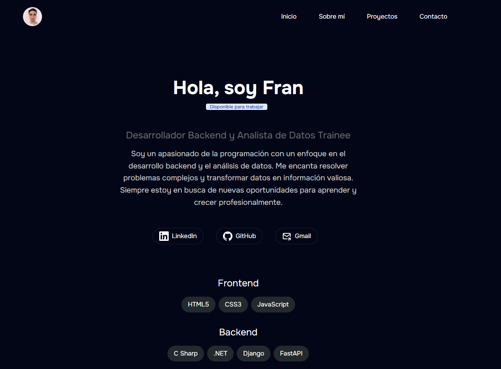

# Fran Serafini - Portafolio

Bienvenidos a mi primer portafolio como Desarrollador BackEnd y Analista de Datos.

 

## Descripción

Este portafolio muestra mis habilidades en desarrollo backend y análisis de datos, así como algunos proyectos destacados. **Actualmente, el portafolio está en construcción.**

## 🚀 Estructura del Proyecto

Dentro de mi proyecto Astro, verás las siguientes carpetas y archivos:

```plaintext
/
├── public/
│   └── favicon.svg
├── src/
│   ├── components/
│   │   └── Card.astro
│   ├── layouts/
│   │   └── Layout.astro
│   └── pages/
│       └── index.astro
└── package.json


